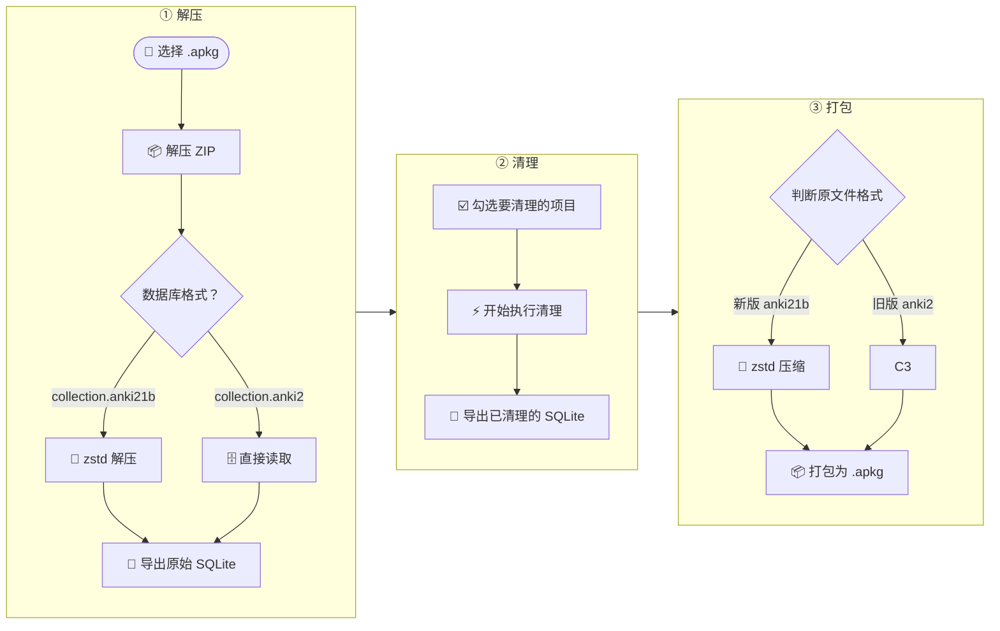
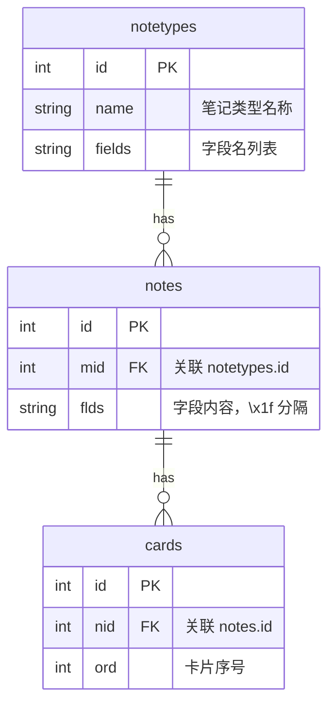

# AnkiHTMLCleaner


一键清理 Anki 牌组中从 Word/网页复制粘贴带来的冗余 HTML。

## 功能流程



## Apkg 文件结构

`.apkg` 文件本质是一个 **ZIP 压缩包**，内部包含：

```
example.apkg
├── collection.anki2       ← 数据库（旧版, SQLite）
├── collection.anki21b     ← 数据库（新版, zstd 压缩的 SQLite）
├── media                  ← 媒体文件列表（JSON）
├── 1.jpg                  ← 图片文件
├── hello.mp3              ← 音频文件
└── ...                     ← 其他附件
```

### 数据库结构

`collection.anki2` 是一个 **SQLite 数据库**，核心表关系：



- **notetypes** — 笔记类型定义（类似模板），记录字段名
- **notes** — 笔记内容，`flds` 列按 `\x1f` 分隔各字段
- **cards** — 卡片实例，关联到笔记

### 新旧版本区别

| 版本 | 数据库文件名 | 压缩方式 | 特征 |
|------|-------------|---------|------|
| 旧版 | `collection.anki2` | 无（直接 ZIP 存储） | 文件较小，直接 SQLite |
| 新版 (2.1.50+) | `collection.anki21b` | **zstd** 压缩 | 文件开头魔数 `28 b5 2f fd` |

本工具自动识别两种格式。

## 清理内容

| 项目 | 说明 |
|------|------|
| `style` 属性 | 删除所有行内样式 |
| `class` 属性 | 删除所有 CSS 类名 |
| `<span>` 标签 | 无显示效果，仅保留内容 |
| `<tbody>` 标签 | 浏览器会自动插入 |
| `<p>` → `<br>` | 段落标签转成换行符 |
| HTML 实体 | `&times;→×` `&divide;→÷` `&nbsp;→空格` 等 |
| `_x000D_` 与注释 | 清除 Windows 换行残留和 `<!-- -->` |
| 多余 `<br>` | 多个 `<br>` 缩为一个，清除首尾无意义的 |
| 表格边框 | 自动添加 `border="1"` 和 `border-collapse` |
| 中文间空格 | 删除中文字符之间的多余空格 |
| 中英/数字空格 | 中文与英文/数字之间补一个空格 |
| 自定义正则 | 用户可自行填写查找/替换规则 |


## 使用方法

### 方式一：运行 exe

下载 `AnkiApkgCleaner.exe`，双击打开，按三标签页依次操作：

1. **① 解压** — 选择 `.apkg` 文件，点击解压
2. **② 清理** — 勾选需要的清理项目，点击开始清理
3. **③ 打包** — 选择输出路径，点击打包

中间产物（原始 SQLite、已清理 SQLite）可通过各标签页的"导出"按钮保存。

### 方式二：源码运行

```bash
pip install zstandard    # 新版 apkg 需要，旧版可跳过
python anki_cleaner.py
```

### 方式三：自行编译

```bash
# 双击 build.bat，或手动运行：
pip install pyinstaller zstandard
pyinstaller --onefile --windowed --icon "AnkiHTMLCleaner.ico" --name "AnkiApkgCleaner" anki_cleaner.py
```

编译完成后，exe 在 `dist\AnkiApkgCleaner.exe`。

## 项目文件

```
AnkiApkgCleaner.exe     ← 打包好的程序（双击运行）
anki_cleaner.py         ← 源码
README.md               ← 本文件
```

## 依赖

- **运行时**：无（exe 自带 Python 运行时）
- **源码运行**：Python 3.8+
- **编译 exe**：`pyinstaller` + `zstandard`
- **可选**：`zstandard`（支持新版 apkg，旧版不需要）
